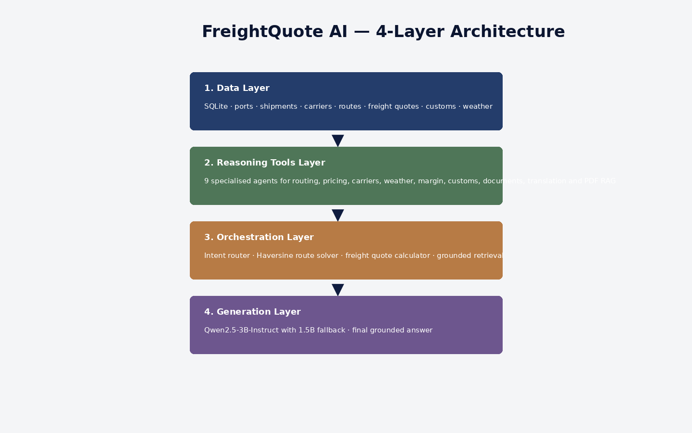
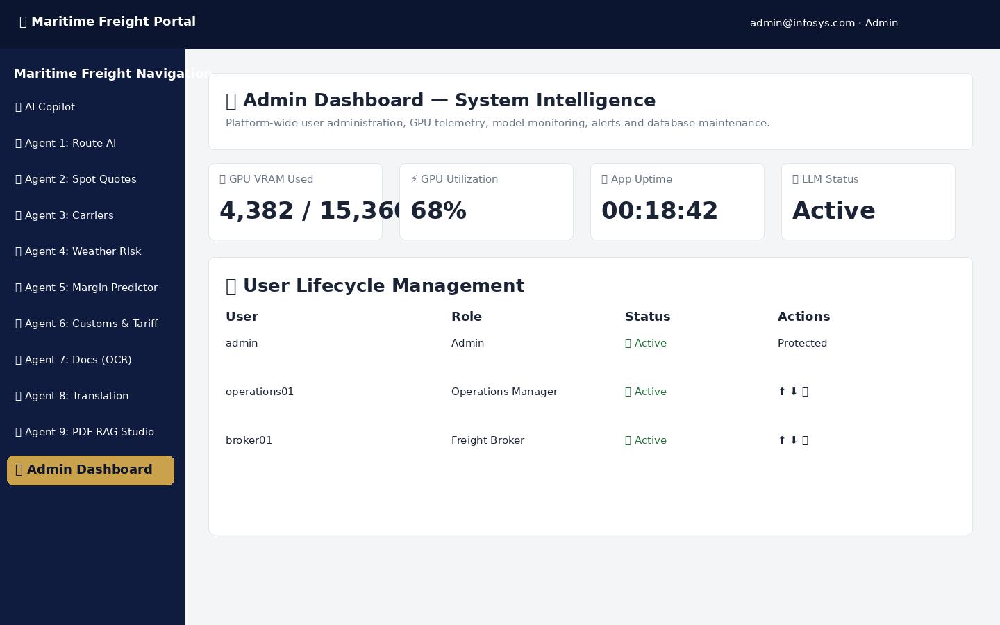
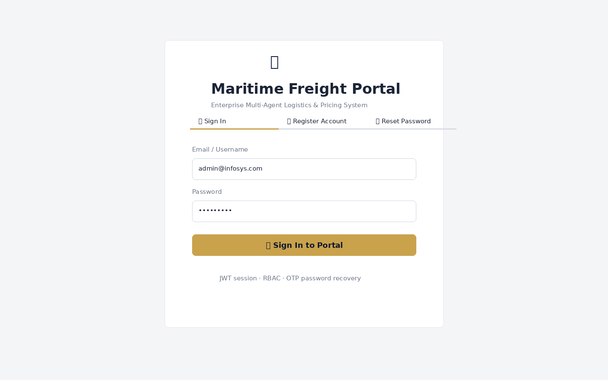
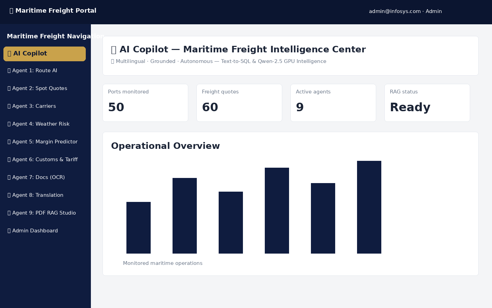
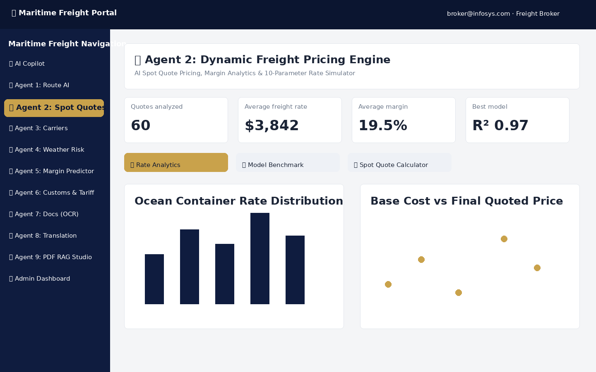
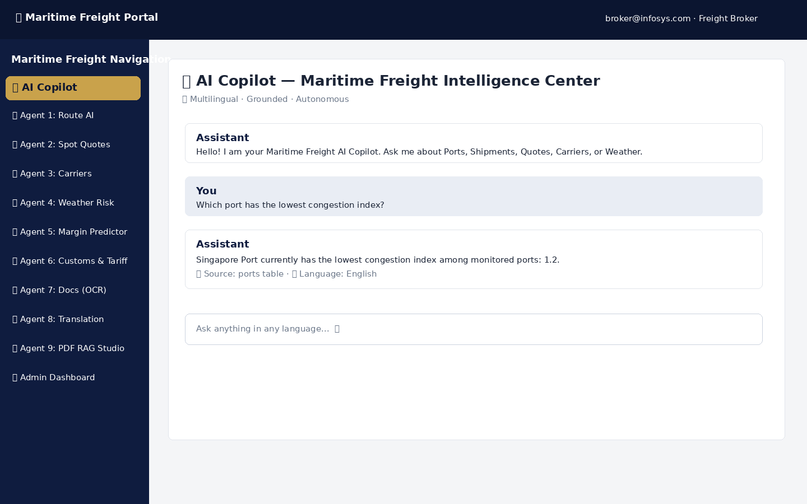

# Agentic AI for Maritime Freight Pricing and Route Optimization

> **Codename:** FreightQuote AI\
> **Infosys Springboard Internship --- Batch 1**\
> **Tagline:** An agentic decision-support copilot for an ocean-freight
> brokerage --- grounded routing, pricing, weather, and compliance
> answers.

[](https://www.python.org/)
[](https://streamlit.io/)
[](https://www.sqlite.org/)

## 1. Program & Team Context

**Program:** Infosys Springboard Internship --- Batch 1

  Name                        Role / What They Built   GitHub handle
  --------------------------- ------------------------ ---------------------
  **Alakshya Nilesh Salvi**   \[Add contribution\]     \[Add GitHub link\]
  **Simran Kapoor**           \[Add contribution\]     \[Add GitHub link\]
  **Nadendla Padhvika**       \[Add contribution\]     \[Add GitHub link\]
  **S Uday Gowda**            \[Add contribution\]     \[Add GitHub link\]
  **Manuru Deepika**          \[Add contribution\]     \[Add GitHub link\]

**Mentor:** **MohammedSipli**

## 2. Overall Project Explanation

### Problem Statement

Ocean-freight brokers and logistics operations teams need to make
decisions across routing, freight pricing, carrier selection, weather
risk, customs compliance, shipping documents, multilingual SOPs, and
internal knowledge. FreightQuote AI brings these operational areas into
one role-aware intelligence portal.

### Solution

FreightQuote AI is a Streamlit-based multi-agent maritime freight
intelligence portal. It combines SQLite operational data, specialised
analytical agents, route and pricing logic, retrieval tools, document
processing, translation, and an LLM-based copilot. The system routes
questions to the relevant operational data, retrieves grounded facts,
and uses Qwen-based generation for the final response. The application
also provides authentication, OTP password recovery, RBAC,
administration, alerts, knowledge graph, digital twin, anomaly scanning
and PDF/RAG capabilities.

### Key Differentiators

-   **Grounded generation:** answers are based on retrieved
    database/knowledge-base facts.
-   **Transparent ML benchmarking:** multiple models are compared for
    specialised operational tasks.
-   **RBAC:** application modules are controlled by the signed-in role.
-   **Fail-soft LLM path:** Qwen 3B can fall back to a smaller 1.5B
    model.
-   **Operational simulators:** routing, pricing, carrier, weather,
    customs, margin and alert scenarios expose configurable parameters.
-   **Document intelligence:** OCR-style extraction, translation and PDF
    retrieval are included.

## 3. Architecture



### 3.1 Data Layer

The notebook creates a local SQLite data store under the configured
runtime data directory. Seed data covers ports, shipments, freight
quotes, carriers, customers, customs/tariffs, weather risks, alerts and
related operational entities.

### 3.2 Reasoning Tools Layer

The nine specialised agents cover routing, pricing, carrier performance,
weather risk, margin optimisation, customs, shipping documents,
translation and PDF RAG.

### 3.3 Orchestration Layer

`intent_router.py` classifies questions into ports, shipments, quotes,
weather, customs, alerts or general intents and retrieves relevant
database facts. The project also contains Haversine-based route
calculations and freight-quote calculation logic.

### 3.4 Generation Layer

The FastAPI model service loads `Qwen/Qwen2.5-3B-Instruct` with 4-bit
NF4 loading when supported and falls back to
`Qwen/Qwen2.5-1.5B-Instruct` when required. The LLM engine uses the
model service to produce grounded responses.

## 4. The 9 Specialised Agents

  ------------------------------------------------------------------------------------------------------------
  Agent            Business function   Data / knowledge    Models / engine                      Main outputs
                                       source                                                   
  ---------------- ------------------- ------------------- ------------------------------------ --------------
  **1. Global      Port congestion,    `ports`             Random Forest, Gradient Boosting,    Folium/map
  Ocean Port &     dwell and                               Decision Tree, Linear/Ridge/Lasso,   view,
  Route            route/fuel analysis                     SVR and other comparative models     bar/scatter
  Intelligence**                                                                                charts, delay
                                                                                                prediction,
                                                                                                sailing
                                                                                                simulator

  **2. Dynamic     Ocean spot pricing  `freight_quotes`    Random Forest Regressor, Gradient    Waterfall,
  Freight Pricing  and quote                               Boosting Regressor, Decision Tree    heatmap,
  & Rate           calculation                             Regressor, Linear Regression and     funnel/bar
  Calculator**                                             comparative models                   analytics,
                                                                                                quote
                                                                                                calculator

  **3. Carrier     Reliability, safety `carriers`          Random Forest Classifier, Gradient   Treemap,
  Performance &    and fleet/capacity                      Boosting Classifier, Decision Tree   scatter,
  Safety Audit**   benchmarking                            Classifier, Logistic Regression, SVC heatmap,
                                                                                                ranking and
                                                                                                capacity
                                                                                                simulator

  **4. Global      Severe-weather risk `weather_risks` +   Random Forest, Gradient Boosting,    Weather map,
  Weather Risk &   at monitored ports  Open-Meteo          Decision Tree, Logistic Regression,  bar/scatter
  Harbor Safety                                            SVC, Linear Regression               analytics,
  Intelligence**                                                                                risk ledger
                                                                                                and rerouting
                                                                                                simulator

  **5. Freight     Margin, revenue and `freight_quotes`    Random Forest Regressor, Gradient    Box plot,
  Margin Optimizer carrier yield                           Boosting Regressor, Decision Tree    heatmap,
  & Profitability  analysis                                Regressor, Linear Regression         histogram,
  Intelligence**                                                                                margin and
                                                                                                yield
                                                                                                analytics

  **6. Customs     Duty, clearance and `customs_tariffs`   Random Forest Classifier, Gradient   Sunburst,
  Intelligence &   regulatory-risk                         Boosting Classifier, Decision Tree   scatter, duty
  HS Code          analysis                                Classifier, Logistic Regression, SVC simulator and
  Compliance**                                                                                  compliance
                                                                                                analysis

  **7. Quote       Shipping-document   `shipments` +       Document processing with             OCR
  Document & Bill  extraction,         uploaded documents  ReportLab/FPDF; notebook also        extraction,
  of Lading        validation and                          includes document-fraud comparison   BoL builder,
  Generator /      generation                                                                   freight quote
  OCR**                                                                                         PDF

  **8. Freight     Multilingual        Built-in maritime   `facebook/nllb-200-distilled-600M`   Translation,
  Document &       freight documents   SOP/glossary                                             batch
  Policy           and SOPs            content                                                  translation,
  Translation                                                                                   SOP
  Engine**                                                                                      translation,
                                                                                                glossary

  **9. Custom PDF  Grounded Q&A over   Uploaded            FAISS + sentence-transformers + BM25 Retrieved
  Knowledge Base & uploaded freight    PDF/TXT/MD +                                             chunks and
  Vector RAG       documents           FAISS/BM25 indexes                                       grounded
  Engine**                                                                                      document
                                                                                                answers
  ------------------------------------------------------------------------------------------------------------

### Supporting operational modules

The notebook also implements: - Real-Time Freight Incident & Alert
Manager / Notifications - Maritime Telemetry Anomaly & Risk Scanner -
Global Ocean Freight Logistics Digital Twin - Freight Knowledge Graph -
Data Feed Center - User Profile - Admin Dashboard - AI Copilot

## 5. Agent Details

### Agent 1 --- Global Ocean Port & Route Intelligence

Provides port congestion/dwell analytics, route intelligence, a
monitored-port network and a 10-parameter vessel sailing/fuel simulator.
The notebook's comparative route table marks Random Forest Regressor as
the optimal model with **R² 0.96 and RMSE 0.4 days**.

### Agent 2 --- Dynamic Freight Pricing Engine

Reads `freight_quotes` and combines rate analytics with a dynamic
spot-quote calculator covering base cost, fuel surcharge,
customs/terminal fees and target margin. The notebook marks Random
Forest Regressor as optimal with **R² 0.97 and RMSE \$65**.

### Agent 3 --- Carrier Performance & Capacity Intelligence

Benchmarks carrier reliability, ratings, SLA/capacity indicators and
allocation scenarios using comparative classification models.

### Agent 4 --- Weather Risk & Harbor Safety

Uses seeded weather-risk records and Open-Meteo context for monitored
ports. It provides weather-risk analytics, map views and vessel/route
rerouting simulation.

### Agent 5 --- Margin Optimizer & Profitability Intelligence

Analyses quote profitability and carrier yield. It provides margin
analytics, yield matrices and configurable profitability scenarios.

### Agent 6 --- Customs Intelligence & HS Code Compliance

Analyses duty rates, clearance risk and regulatory requirements using
`customs_tariffs` and includes an 8-parameter duty simulator.

### Agent 7 --- Digital Bill of Lading & Document OCR Studio

Supports PDF/TXT upload, sample shipping-document extraction, Bill of
Lading construction and document-fraud comparison.

### Agent 8 --- Multilingual Maritime SOP & Document Translation Studio

Uses NLLB-200 distilled 600M and provides real-time translation,
maritime SOP translation, batch translation, glossary and a 20+ language
roster.

### Agent 9 --- PDF SOP & Freight Document RAG Studio

Accepts PDF/TXT/MD documents, extracts and indexes their contents, then
retrieves relevant passages for grounded document Q&A.

## 6. Authentication, OTP & Security

### Authentication Flow

**Sign up → Login → JWT session → Forgot Password → OTP → Security
Question fallback → Password reset**

The notebook implements password hashing, progressive failed-login
lockout, JWT session state, enterprise-role registration, Gmail OTP
recovery, security-question fallback and profile/password management.

OTP credentials are configured through environment variables/Colab
Secrets and must never be committed to the repository.

### RBAC Roles

  -----------------------------------------------------------------------
  Role                                Typical Access
  ----------------------------------- -----------------------------------
  **Admin**                           Full application, Data Feed Center
                                      and Admin Dashboard

  **Operations Manager**              Full operational access + Data Feed
                                      Center, excluding Admin Dashboard

  **Freight Broker**                  Operational agents and AI Copilot;
                                      read-oriented

  **Auditor**                         Read-only operational access plus
                                      oversight/Admin Dashboard
                                      capabilities

  **Customer**                        AI Copilot and selected
                                      customer-facing operational modules
  -----------------------------------------------------------------------

## 7. Admin Dashboard

The Admin Dashboard provides:

-   GPU VRAM and GPU utilisation telemetry
-   Application uptime and LLM status
-   User lifecycle management
-   Role promotion/demotion
-   Account lock/unlock
-   User deletion
-   ML model performance information
-   LLM activity monitoring
-   Alert monitoring
-   SQLite database maintenance/re-seeding



## 8. Screenshots / Application Preview

The following visuals are included with this README and are aligned to
the UI implemented in the Milestone 4 notebook.

### Login / Authentication



### Main Maritime Freight Portal



### Agent 2 --- Dynamic Freight Pricing



### AI Copilot --- Grounded Question



### Admin Dashboard


## 9. Demo Video

A silent product walkthrough covering the main FreightQuote AI flow: authentication, the main maritime portal, dynamic freight pricing, the AI Copilot, and the Admin Dashboard.

**[▶ Watch / Open the Demo Video](docs/demo/demo.mp4)**

> The included video is a presentation-style walkthrough of the prepared application UI visuals.

## 9. Technology Stack

  ------------------------------------------------------------------------
  Layer                   Technology               Purpose
  ----------------------- ------------------------ -----------------------
  UI                      Streamlit                Interactive enterprise
                                                   portal

  Navigation              streamlit-option-menu    Role-aware navigation

  Database                SQLite                   Local operational data
                                                   store

  Data processing         Pandas, NumPy            Data preparation and
                                                   analytics

  ML                      scikit-learn             Predictive modelling
                                                   and benchmarking

  Visualisation           Plotly, Folium,          Charts and maps
                          streamlit-folium         

  LLM                     Qwen2.5-3B-Instruct /    Grounded
                          1.5B fallback            natural-language
                                                   generation

  NLP                     NLLB-200 distilled 600M  Multilingual
                                                   translation

  RAG                     FAISS,                   Document retrieval
                          sentence-transformers,   
                          BM25                     

  Documents               pdfplumber, ReportLab,   PDF extraction and
                          FPDF, PyMuPDF            generation

  Authentication          bcrypt, PyJWT            Password hashing and
                                                   JWT sessions

  Weather                 Open-Meteo               Port weather context

  API service             FastAPI + Uvicorn        Qwen/NLLB model service

  Optional ingestion      Kaggle API               Data Feed Center
  ------------------------------------------------------------------------

## 10. Installation & Run

The supplied Milestone 4 notebook is structured for a Google
Colab/Linux-style environment.

### Local / Repository Flow

``` bash
git clone https://github.com/<org-or-user>/freightquote-ai.git
cd freightquote-ai

python -m venv venv

# Windows
venv\Scripts\activate

# Linux/macOS
source venv/bin/activate

pip install -r freight_app/requirements.txt
streamlit run freight_app/app.py
```

### Configure Environment Variables

Create `.env` locally or configure Colab Secrets.

  -----------------------------------------------------------------------
  Variable                            Purpose
  ----------------------------------- -----------------------------------
  `HF_TOKEN` / `HUGGINGFACE_TOKEN`    Hugging Face model access when
                                      required

  `JWT_SECRET_KEY`                    JWT signing secret

  `EMAIL_ID`                          Dedicated project OTP mailbox

  `EMAIL_PASSWORD`                    Gmail App Password for OTP SMTP

  `FREIGHTQUOTE_DATA_DIR`             Optional runtime-data directory
  -----------------------------------------------------------------------

Never commit real values.

### Database

The notebook initializes and seeds SQLite using:

``` python
from db import init_db
import seed_data

init_db()
seed_data.seed_all()
```

### Google Colab Workflow

The notebook's intended execution sequence is:

1.  Create `freight_app/` directories --- Cell 1.
2.  Install dependencies --- Cell 2.
3.  Write the application files --- Cells 3--37.
4.  Run the dependency check --- Cell 38.
5.  Initialize and seed SQLite --- Cell 39.
6.  Boot the Qwen/NLLB FastAPI service --- Cell 40.
7.  Launch Streamlit and Cloudflare Tunnel --- Cell 41.
8.  Run the authentication/Gmail diagnostic --- Cell 42.
9.  Run the verification/debug cells as required --- Cells 43--56.

The notebook starts the model service on port `8000` and Streamlit on
port `8501`.

## 11. requirements.txt

The notebook currently writes dependencies with version ranges such as
`streamlit>=...`. The repository instructions require exact `==` pins
for final submission.

Before final submission:

``` bash
pip freeze > requirements.txt
```

Then remove unused packages and test the file in a clean virtual
environment.

Heavy packages include PyTorch, Transformers, bitsandbytes,
sentence-transformers and FAISS. Model weights can require several GB of
storage and a GPU is recommended for the intended Qwen/NLLB workflow.

## 12. Demo Video

The repository instructions require a **silent 2--5 minute `.mp4` demo**
covering:

**Login → OTP forgot-password flow → Core Agent → AI Copilot → Admin
Dashboard**

Recommended location:

``` text
docs/demo/demo.mp4
```

If the file is too large for GitHub, link an unlisted Google
Drive/YouTube copy from the README instead.

## 13. Secrets & Security Checklist

Never commit:

-   Hugging Face tokens
-   Kaggle credentials
-   Gmail passwords or App Passwords
-   JWT signing secrets
-   `.env` files containing real values
-   Database dumps containing real personal data

Use `.env.example` with variable names/placeholders only.

Recommended `.gitignore` entries:

``` text
.env
*.db
__pycache__/
*.ipynb_checkpoints
```

For OTP email, use a dedicated project Gmail account with 2-Step
Verification and a Gmail App Password.

## 14. Maritime Glossary

  -----------------------------------------------------------------------
  Term                                Meaning
  ----------------------------------- -----------------------------------
  **BAF**                             Bunker Adjustment Factor ---
                                      fuel-related freight surcharge

  **TEU**                             Twenty-foot Equivalent Unit ---
                                      standard container capacity measure

  **HS Code**                         Harmonized System code used to
                                      classify traded goods

  **Dwell Time**                      Time cargo/container remains at a
                                      port or terminal

  **Bill of Lading (BoL)**            Shipping document describing cargo,
                                      shipment and transport terms
  -----------------------------------------------------------------------

## 15. Hardware & Runtime Notes

The notebook is designed around a GPU-capable Colab environment.

The model server: - Uses PyTorch and CUDA when available. - Targets
Qwen2.5-3B-Instruct. - Uses 4-bit NF4 loading when supported. - Falls
back to Qwen2.5-1.5B-Instruct when necessary. - Loads NLLB-200 distilled
600M for translation.

The application can operate in CPU mode for selected functionality, but
full LLM/translation performance requires substantially more resources.

## 16. Known Limitations

-   The notebook is primarily structured for a Colab/GPU-style execution
    environment.
-   Some operational data is seeded/synthetic rather than production
    maritime telemetry.
-   SQLite is suitable for the prototype but is not a production-scale
    multi-user database.
-   Open-Meteo, Hugging Face and Gmail functionality depend on
    connectivity/configuration.
-   LLM and translation models require significant compute and storage.

## 17. Future Scope

-   Move SQLite to PostgreSQL for production multi-user deployments.
-   Add real carrier/port data feeds and streaming telemetry.
-   Add production model monitoring and automated retraining.
-   Deploy the model service and Streamlit frontend as scalable cloud
    services.
-   Expand document RAG with stronger access controls, citations and
    enterprise document permissions.
-   Add richer real-time maritime event ingestion and automated
    operational escalation.

## 18. Acknowledgements

This project was developed as part of the **Infosys Springboard
Internship --- Batch 1**.

**Mentor:** **MohammedSipli**

## 19. Repository Structure

``` text
freightquote-ai/
├── README.md
├── requirements.txt
├── .env.example
├── .gitignore
├── docs/
│   ├── architecture-diagram.png
│   ├── screenshots/
│   │   ├── 01-login.png
│   │   ├── 02-dashboard.png
│   │   ├── 03-agent2-spot-quotes.png
│   │   ├── 04-ai-copilot.png
│   │   └── 05-admin-dashboard.png
│   └── demo/
│       └── demo.mp4
├── freight_app/
│   ├── app.py
│   ├── auth.py
│   ├── rbac.py
│   ├── db.py
│   ├── seed_data.py
│   ├── intent_router.py
│   ├── llm_engine.py
│   ├── rag_engine.py
│   ├── translation_engine.py
│   ├── model_server.py
│   ├── admin_dash.py
│   └── ...
└── milestone notebooks/
```

## 20. Final Pre-Submission Checklist

-   [x] Root-level `README.md` included.
-   [x] Mentor name added: MohammedSipli.
-   [x] All five team-member names added.
-   [ ] Team contributions filled in.
-   [ ] GitHub handles/links filled in.
-   [x] Architecture diagram embedded.
-   [x] All nine specialised agents documented.
-   [ ] Exact pinned `requirements.txt` generated and tested in a clean
    venv.
-   [ ] `.env.example` present; real `.env` is gitignored.
-   [ ] No tokens/passwords committed.
-   [ ] Silent 2--5 minute demo video added or linked.
-   [x] Login, dashboard, agent, AI Copilot and admin visuals included.
-   [ ] OTP forgot-password flow shown in the final demo/screenshots.
